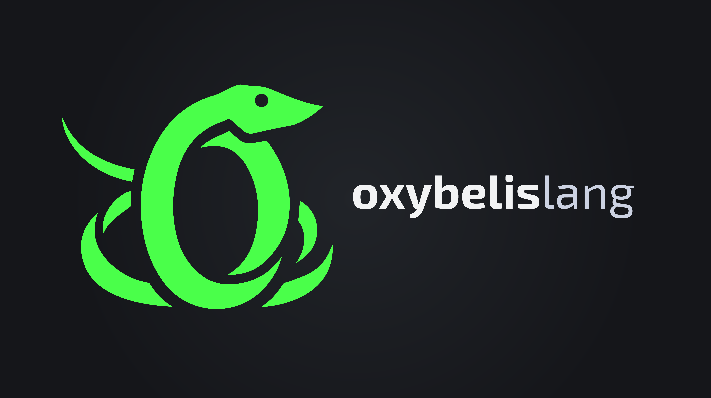

# Oxybelis

A statically-typed, Python-inspired language that transpiles to C++.

```rust
fn main() {
    for x in fib_gen(50) {
        print(x);
    }
}

fn fib_gen(limit: int) -> Generator<int> {
    var a = 0;
    var b = 1;
    while a < limit {
        yield a;
        var next = a + b;
        a = b;
        b = next;
    }
}
```

## Quick Start

**Prerequisites:** A C++20 compiler (`g++` ≥11, `clang++` ≥14, or MSVC).

### Install

```powershell
# Windows (PowerShell)
irm https://raw.githubusercontent.com/oxybelis-lang/oxybelis/main/install.ps1 | iex
```

```bash
# Linux / macOS
curl -fsSL https://raw.githubusercontent.com/oxybelis-lang/oxybelis/main/install.sh | sh
```

Installs `oxybelis` to `~/.oxybelis/bin/` and adds it to PATH.

### Run a file

```bash
echo 'fn main() { print("hello world") }' > hello.ox
oxybelis hello.ox     # compiles + runs, prints "hello world"
```

### Run with Python

```bash
git clone https://github.com/oxybelis-lang/oxybelis.git
cd oxybelis
python oxybelis.py hello.ox
```

The Python version has a full type checker (`--check`). The bootstrapped compiler (`compiler.ox`) also has a full type checker and supports self-hosting — `compiler.exe compiler.ox -S` produces a correct `compiler2.exe` that passes its own `--check`.

## CLI

```
oxybelis examples/basics.ox       # compile + run
oxybelis -S examples/basics.ox    # emit C++ to stdout
oxybelis -o out.cpp file.ox       # write C++ to file
oxybelis --cc clang++ file.ox     # use a different C++ compiler
oxybelis examples/basics.ox --check  # type-check only (Python version)
```

## Language Features

- **Python-inspired syntax** with `{}` blocks
- **Static typing:** `int`, `float`, `bool`, `str`, `void`, generics
- **Generators:** `yield` keyword with state-machine transpilation — no C++20 coroutines needed. `Generator<T>` supports range-for iteration.
- **Functional chaining:** `.map()`, `.filter()`, `.reduce()`, `.any()`, `.all()`, `.find()`, `.sum()`, `.min()`, `.max()`, `.for_each()`
- **Iterator toolkit:** `.combinations(k)`, `.permutations(k)`, `.chunked(n)`, `.windowed(n)`, `.pairwise()`, `.reversed()`, `.cycle(n)`, `.take_while(pred)`, `.drop_while(pred)`
- **Classes** with fields and methods
- **Pattern matching** with ranges and wildcards
- **Null safety** via `Option<T>` (maps to `std::optional`)
- **`Result<T, E>`** with `?` operator
- **`let`** (immutable) / **`var`** (mutable) bindings
- **Standard library:** `json`, `collections`, `path`, `fs`
- **Self-hosting** compiler written in Oxybelis itself

## Examples

```bash
# Try the feature-specific examples:
python oxybelis.py examples/generators.ox     # yield / Generator<T>
python oxybelis.py examples/functional.ox     # map, filter, reduce, ...
python oxybelis.py examples/itertools.ox      # combinations, chunked, ...
python oxybelis.py examples/classes.ox        # classes and methods
python oxybelis.py examples/match.ox          # pattern matching
python oxybelis.py examples/option.ox         # Option/Optional type
python oxybelis.py examples/basics.ox         # basic functions and types
python oxybelis.py examples/nim_like.ox       # Nim-style features
python oxybelis.py examples/strings.ox        # string manipulation
python oxybelis.py examples/math_demo.ox      # math/NumCpp demo
```

## Project Structure

| Path | Purpose |
|---|---|
| `oxybelis.py` | Python reference compiler (full type checker) |
| `compiler.ox` | Self-hosting compiler (bootstrap target) |
| `compiler.exe` | Pre-built bootstrapped compiler |
| `oxlib/` | Standard library modules (`json`, `path`, `fs`, `collections`) |
| `examples/` | Feature-specific example programs |
| `tests/` | Test suite (`python tests/run_tests.py`) |
| `install.ps1` / `install.sh` | Cross-platform installers |

## Test

```bash
python tests/run_tests.py                  # run all test suites
python oxybelis.py examples/basics.ox      # compile + run the basics demo
```

## License

GNU General Public License v3.0
